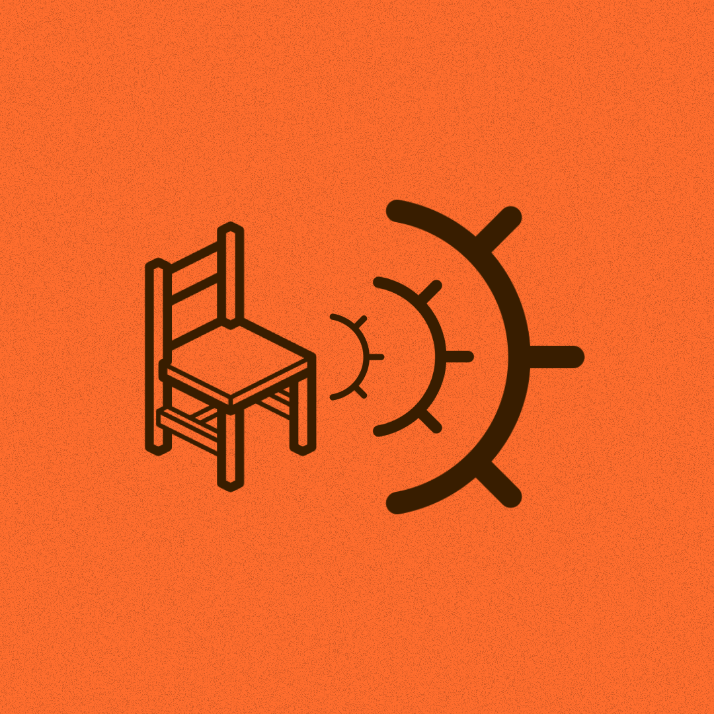

# Seatsight
## Seatsight is a system that is designed to identify the available seats in restaurants. 
This system contain three technologies
- Web App : developed using ExpresJs, NodeJs and EJS
- Deep Learning model : Custom trained yolo model
- Application For Mobile : Native android app developed using Kotlin

## How its work
The sytem is interconnected with these tech using RESTapi and FastApi. Postgres is used as the database.

